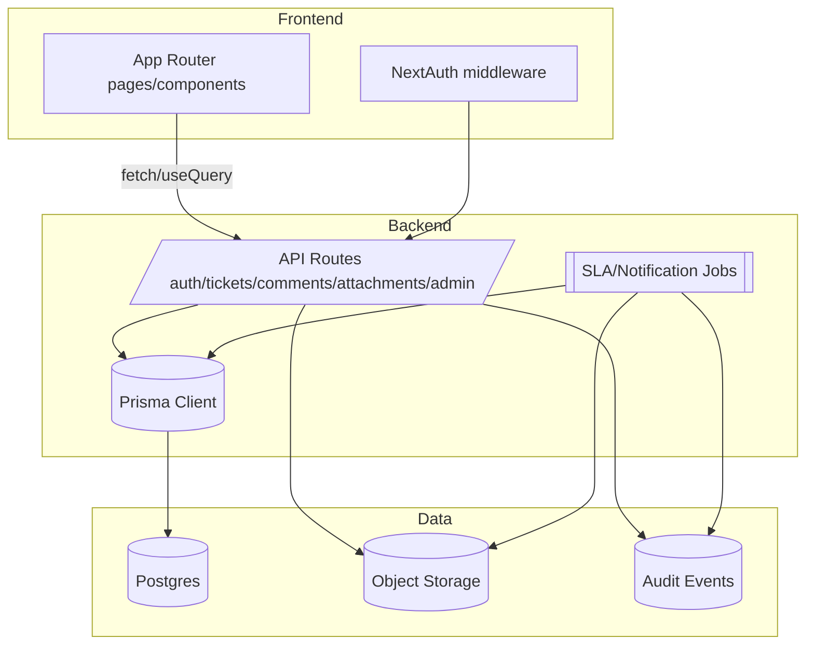

# Blueprint Master

## Executive summary
- Repository implements a Next.js 16 helpdesk MVP with credential auth, protected `/app/*` area, ticket listing/detail, and create/update APIs backed by Prisma/Postgres; collaboration and ops features are incomplete.
- Priority gaps: missing comments API, broken dashboard search filter, no pagination, incomplete SLA stamping, and absent attachments/admin tooling. These drive the near-term plan in MVP (P0) and V1 (P1).
- Target design adds resilient queues, scoped collaboration (public/internal comments, attachments), SLA automation, admin/self-serve setup, and reporting while preserving strict org/role scoping and auditability.

## Current state (condensed, evidence-backed)
- Stack: Next.js App Router + TypeScript + Tailwind + NextAuth (JWT, Prisma adapter), Prisma/Postgres, React Query, Zod validation, bcrypt, Vitest/Playwright scaffolding (`package.json`).
- Auth: credential login, bcrypt verification, JWT session with role/org claims, middleware protection on `/app/*` and server-side redirects (`middleware.ts`, `src/lib/auth.ts`, `src/types/next-auth.d.ts`).
- Data: Prisma models for orgs, users (roles), teams, tickets (status/priority, SLA timestamps), comments (internal flag), attachments metadata, tags, audit events, SLA policies (`prisma/schema.prisma`).
- API: ticket list/create under `/api/tickets`, update under `/api/tickets/[id]`; scoped by requester vs organization with audit on create/update; comment endpoint missing (`src/app/api/tickets/route.ts`, `src/app/api/tickets/[id]/route.ts`).
- UI: dashboard with filters/search + quick create, ticket detail with actions/comments (client-side only), new ticket page, comment form posts to missing endpoint (`src/app/app/page.tsx`, `src/app/app/ticket-form.tsx`, `src/app/app/tickets/[id]/*`).
- Seed: demo org, admin/agent/requester users, IT Support team, tags, SLA policies per priority, sample ticket/comment/audit for immediate login/testing (`prisma/seed.js`).

## Current-state evidence (25 claims with path citations)
1. Next.js, Tailwind, Prisma, NextAuth, React Query, Zod, Vitest/Playwright are declared dependencies/scripts in `package.json`.
2. Middleware protects `/app/:path*` via NextAuth middleware export in `middleware.ts`.
3. NextAuth uses PrismaAdapter with credential provider and bcrypt password check in `src/lib/auth.ts`.
4. JWT session strategy stores role and organizationId claims in callbacks in `src/lib/auth.ts`.
5. Session/JWT typings extend user to include role and organizationId in `src/types/next-auth.d.ts`.
6. Roles enum defines REQUESTER/AGENT/ADMIN in `prisma/schema.prisma`.
7. TicketStatus enum tracks NOWE -> W_TOKU -> OCZEKUJE_NA_UZYTKOWNIKA -> WSTRZYMANE -> ROZWIAZANE -> ZAMKNIETE -> PONOWNIE_OTWARTE lifecycle in `prisma/schema.prisma`.
8. TicketPriority enum spans NISKI -> SREDNI -> WYSOKI -> KRYTYCZNY in `prisma/schema.prisma`.
9. Ticket model stores descriptionMd, SLA due/actual timestamps, assignee user/team, and audit relations in `prisma/schema.prisma`.
10. Comment model includes isInternal flag and Markdown body in `prisma/schema.prisma`.
11. Attachment model stores filename/path/mime/size with uploader relation in `prisma/schema.prisma`.
12. SlaPolicy ties firstResponseHours/resolveHours to priority per org in `prisma/schema.prisma`.
13. Seed creates demo org, admin/agent/requester users with bcrypt hashes in `prisma/seed.js`.
14. Seed provisions IT Support team with membership and tags (VPN/Laptop/Siec) in `prisma/seed.js`.
15. Seed inserts SLA policies for all priorities and sample ticket with comment/audit in `prisma/seed.js`.
16. Ticket list API scopes requester to own tickets, agents/admins to organization in `src/app/api/tickets/route.ts`.
17. Ticket list API orders by createdAt desc and includes requester/assignee relations without pagination in `src/app/api/tickets/route.ts`.
18. Ticket create API validates title/descriptionMd/priority and writes SLA due timestamps plus audit event in `src/app/api/tickets/route.ts`.
19. Ticket update API rejects unauthenticated requests and checks org ownership before updates in `src/app/api/tickets/[id]/route.ts`.
20. Requesters are limited to close/reopen on their own tickets; priority/assignee changes blocked in `src/app/api/tickets/[id]/route.ts`.
21. Agents/Admins can change status/priority/assignees with org validation and audit logging in `src/app/api/tickets/[id]/route.ts`.
22. Status transitions set resolvedAt/closedAt timestamps in `src/app/api/tickets/[id]/route.ts`.
23. Dashboard page filters by status/priority and attempts search on non-existent `description` field in `src/app/app/page.tsx`.
24. Dashboard renders quick ticket form for new submissions in `src/app/app/page.tsx`.
25. Ticket detail page hides other users' tickets from requesters and renders comment form pointing to missing endpoint in `src/app/app/tickets/[id]/page.tsx` and `src/app/app/tickets/[id]/comment-form.tsx`.

## Target specification
### Workflow
- Ticket lifecycle: NOWE -> W_TOKU/WSTRZYMANE/OCZEKUJE_NA_UZYTKOWNIKA -> ROZWIAZANE -> ZAMKNIETE with reopen path to PONOWNIE_OTWARTE. SLA timers start on create, first-response stamps on first agent/internal/public comment, resolution stamps on ROZWIAZANE; closures optionally auto-close after timeout.
- Intake: web form (requester/self-serve) with category/tags, org-scoped. Quick-create remains but validates server-side.
- Actions: agents/admins manage status, priority, assignment (user/team), tags; requesters may close/reopen and add public comments; escalation via teams/queues.

### Permissions & scoping
- Org isolation on all APIs, queries, and storage; tenant-aware attachments and audit logs.
- Roles: REQUESTER (own tickets, public comments, close/reopen), AGENT (org tickets, assign, internal notes, SLA edits), ADMIN (org admin CRUD, reporting, impersonation audit), with optional future role for observer.
- Field-level guards: requester cannot change priority/assignees; internal comments only for agent/admin; attachments gated by ticket org and ownership.

### Queues and routing
- Queues: My Tickets, Unassigned, Team queues, SLA Breach Imminent, Recently Updated, and Saved Filters per user.
- Routing rules: default queue ordering by SLA breach risk then priority, with pagination; assignment suggestions based on team membership; bulk actions for admins/agents.

### Collaboration & notifications
- Comments API with public/internal flags, Markdown validation, edit window (agent/admin), delete with audit trail, author visibility chips.
- Mentions/notifications: email and in-app notifications for assignment, status change, SLA breach, mention; digest option.
- Activity feed shows audit events (create/update/comment/attachment).

### Attachments
- Upload service with size/mime/type validation, virus scan hook, org-scoped storage path, signed download URLs with expiry; attachment preview metadata saved in DB.
- Quotas per org/user and per-ticket limits; delete with audit.

### SLA & timers
- SLA policies per org/priority (existing), with scheduler/worker to mark breaches, recompute when priority/status changes, and first-response/resolution stamping.
- SLA dashboards: breach counts, MTTA/MTTR per team/agent.

### Admin
- Org admin UI/API for users, teams, tags, categories, SLA policies, canned responses, notification templates; audit log for all admin actions.
- Self-service onboarding flow to invite users and set initial SLA/tag defaults.

### Reporting
- Operational reports: backlog, inflow/outflow, SLA compliance, agent productivity, tag/category distribution; export CSV.
- Observability: request metrics, background job health, error budgets for APIs.

## Architecture
### Current
- Next.js App Router with server components for dashboard/ticket detail; API routes for auth/tickets; Prisma ORM to Postgres; client-side React Query on ticket actions; static seed data.
- Authentication via NextAuth (JWT) with middleware enforcement; no background workers; storage limited to DB.

### Target
- Preserve Next.js App Router + API routes; add background job runner (e.g., Next.js route handlers + cron or external worker) for SLA timers/notifications.
- Storage: Postgres for relational data, object storage (S3-compatible) for attachments with signed URLs.
- Observability: logging/audit events in DB; metrics hooks for API and jobs.

### Data model strategy & migrations
- Normalize attachments: ensure storageKey, checksum, size limits; add soft-delete flag and uploadedBy relation.
- Comments: add editedAt/editedBy, parentId for threading (future), mention metadata table for notifications.
- Tickets: add pagination indexes on status/priority/updatedAt; add SLA breach flags, lastPublicCommentAt; add queue labels.
- Admin: add table for saved filters and notification preferences.
- Migration steps: (1) add new columns/tables with defaults; (2) backfill counters and SLA timestamps for existing tickets via script; (3) deploy code using new schema; (4) remove deprecated fields after validation.

### API contract (high-level)
- Canonical sources: `docs/openapi.yaml` (machine contract) with supporting docs `docs/api-contracts-target.md`, `docs/contract-conventions.md`, and `docs/error-model.md`. Changes must land in OpenAPI first, then be mirrored to code/tests.
- Auth: `/api/auth/[...nextauth]` (existing) + admin token/email hooks for invites.
- Tickets: list/create/update (existing), add paginated filters; add `/api/tickets/[id]/comments` CRUD; `/api/tickets/[id]/attachments` upload/download/delete; `/api/tickets/search` for saved filters; `/api/queues/*` for queue summaries.
- Admin: `/api/admin/users`, `/api/admin/teams`, `/api/admin/tags`, `/api/admin/sla-policies`, `/api/admin/notifications`.
- Reporting: `/api/reports/*` for SLA/backlog exports.

### UX contract (routes + key states)
- `/login` auth flow; `/app` dashboard with filters, pagination, queues tab, quick create.
- `/app/tickets/new` full create form with validation preview.
- `/app/tickets/[id]` detail with status/assignee actions, comments, attachments, audit timeline, SLA chips; 404 for out-of-org or missing.
- `/app/admin/*` for users/teams/SLA/tags.
- `/app/reports` for SLA/backlog dashboards and exports.

### Security/ops baseline
- Enforce org scoping in every query and storage path; signed URLs for attachments with short TTL and role check; rate limit mutation endpoints; CSRF via NextAuth protections; input validation with Zod on every route.
- Audit log for authentication events, admin changes, comment/attachment operations, and queue reassignments.
- Backups: daily DB backups, retention policy; storage bucket versioning; recovery runbook.
- Secrets management via environment variables; no secrets in repo; local `.env.local` gitignored.

### Testing strategy
- Unit: validation schemas, permission helpers, SLA calculators.
- Integration: API route tests (auth required paths, scoping, pagination), attachment upload stubbed storage, comment creation visibility.
- E2E: sign-in, dashboard filters, ticket create/update, comment add (public/internal), attachment upload/download, admin CRUD smoke, SLA breach simulation.
- Performance: ticket list pagination under large dataset; attachment upload size limits; job throughput for SLA scans.
- Security: authorization regression tests, signed URL expiry, SSRF-safe upload, rate-limit behavior.

## Risks and mitigations (top 20 mapped to plan tasks)
- R1 Missing comments API blocks collaboration -> mitigated by tasks P0-03, P0-06, P0-08.
- R2 Dashboard search uses nonexistent field (runtime errors) -> PH0-06, P0-01.
- R3 Unbounded ticket queries -> P0-02, P0-09.
- R4 SLA timestamps not updated -> P0-04, P1-02.
- R5 Attachment handling absent (security risk) -> P1-10, P1-12, P1-13.
- R6 Org scoping gaps in new endpoints -> P0-05, P0-08, P1-05.
- R7 Audit coverage insufficient for compliance -> P0-10, P1-06, P2-05.
- R8 Pagination/filters regressions on large data -> P0-09, P1-08.
- R9 Notification spam or leakage -> P1-18, P1-20.
- R10 Background jobs impacting app performance -> P1-16, P1-17, P1-22.
- R11 Attachment virus/malware risk -> P1-12, P1-13.
- R12 Role misuse (requester privilege escalation) -> P0-05, P1-04, P1-07.
- R13 Data migration risk for SLA/attachments -> P0-11, P1-09, P1-21.
- R14 Reporting accuracy and PII exposure -> P2-06, P2-09.
- R15 Queue logic causing starvation -> P1-03, P1-08.
- R16 Notification reliability (jobs failing) -> P1-17, P2-04.
- R17 Observability gaps hide breaches -> P0-12, P2-02.
- R18 Accessibility/UX regressions on new flows -> P0-13, P1-14, P2-12.
- R19 Backup/restore not validated -> P2-05, P2-14.
- R20 Compliance for attachment retention -> P2-07, P2-10.

## Unknowns and verification
- Storage provider choice (local/S3/other) -> decide before attachment work; verify with integration test upload/download in staging.
- Email provider/access for notifications -> confirm credentials and throttling; send test messages and monitor deliverability.
- Background job runner (cron vs external worker) -> proof-of-concept load test on staging.
- Reporting scope/PII policy per org -> run stakeholder review before exposing exports.
- SLA policy ownership (per org? per team?) -> confirm; add migration script accordingly.
- Internationalization requirements for UI/emails -> check; if needed, add i18n framework.
