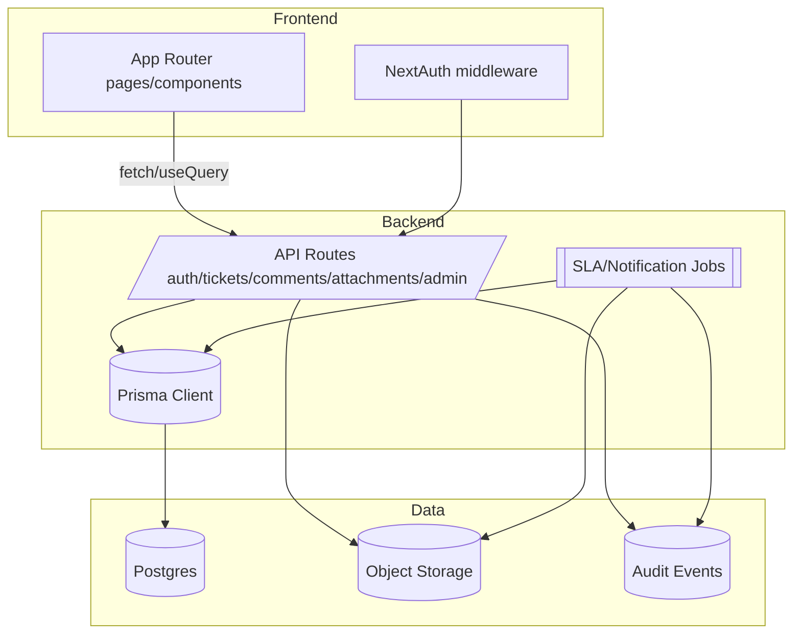
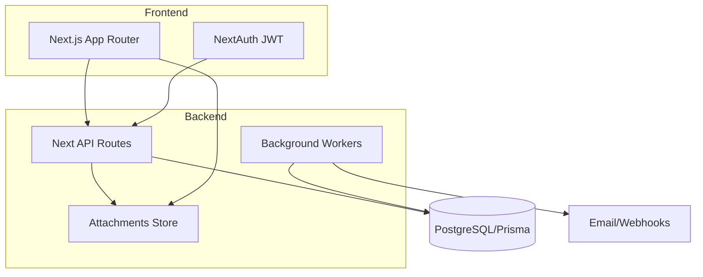

# Blueprint Master

## Executive summary
- Repository implements a Next.js 16 helpdesk MVP with credential auth, protected `/app/*` area, ticket listing/detail, and create/update APIs backed by Prisma/Postgres; collaboration and ops features are incomplete.
- Priority gaps: missing comments API, broken dashboard search filter, no pagination, incomplete SLA stamping, and absent attachments/admin tooling. These drive the near-term plan in MVP (P0) and V1 (P1).
- Target design adds resilient queues, scoped collaboration (public/internal comments, attachments), SLA automation, admin/self-serve setup, and reporting while preserving strict org/role scoping and auditability.

## Current state (condensed, evidence-backed)
- Stack: Next.js App Router + TypeScript + Tailwind + NextAuth (JWT, Prisma adapter), Prisma/Postgres, React Query, Zod validation, bcrypt, Vitest/Playwright scaffolding (`package.json`).
- Auth: credential login, bcrypt verification, JWT session with role/org claims, middleware protection on `/app/*` and server-side redirects (`middleware.ts`, `src/lib/auth.ts`, `src/types/next-auth.d.ts`).
- Data: Prisma models for orgs, users (roles), teams, tickets (status/priority, SLA timestamps), comments (internal flag), attachments metadata, tags, audit events, SLA policies (`prisma/schema.prisma`).
- API: ticket list/create under `/api/tickets`, update under `/api/tickets/[id]`; scoped by requester vs organization with audit on create/update; comment endpoint missing (`src/app/api/tickets/route.ts`, `src/app/api/tickets/[id]/route.ts`).
- UI: dashboard with filters/search + quick create, ticket detail with actions/comments (client-side only), new ticket page, comment form posts to missing endpoint (`src/app/app/page.tsx`, `src/app/app/ticket-form.tsx`, `src/app/app/tickets/[id]/*`).
- Seed: demo org, admin/agent/requester users, IT Support team, tags, SLA policies per priority, sample ticket/comment/audit for immediate login/testing (`prisma/seed.js`).

## Current-state evidence (25 claims with path citations)
1. Next.js, Tailwind, Prisma, NextAuth, React Query, Zod, Vitest/Playwright are declared dependencies/scripts in `package.json`.
2. Middleware protects `/app/:path*` via NextAuth middleware export in `middleware.ts`.
3. NextAuth uses PrismaAdapter with credential provider and bcrypt password check in `src/lib/auth.ts`.
4. JWT session strategy stores role and organizationId claims in callbacks in `src/lib/auth.ts`.
5. Session/JWT typings extend user to include role and organizationId in `src/types/next-auth.d.ts`.
6. Roles enum defines REQUESTER/AGENT/ADMIN in `prisma/schema.prisma`.
7. TicketStatus enum tracks NOWE→ZAMKNIETE lifecycle in `prisma/schema.prisma`.
8. TicketPriority enum spans NISKI→KRYTYCZNY in `prisma/schema.prisma`.
9. Ticket model stores descriptionMd, SLA due/actual timestamps, assignee user/team, and audit relations in `prisma/schema.prisma`.
10. Comment model includes isInternal flag and Markdown body in `prisma/schema.prisma`.
11. Attachment model stores filename/path/mime/size with uploader relation in `prisma/schema.prisma`.
12. SlaPolicy ties firstResponseHours/resolveHours to priority per org in `prisma/schema.prisma`.
13. Seed creates demo org, admin/agent/requester users with bcrypt hashes in `prisma/seed.js`.
14. Seed provisions IT Support team with membership and tags (VPN/Laptop/Sieć) in `prisma/seed.js`.
15. Seed inserts SLA policies for all priorities and sample ticket with comment/audit in `prisma/seed.js`.
16. Ticket list API scopes requester to own tickets, agents/admins to organization in `src/app/api/tickets/route.ts`.
17. Ticket list API orders by createdAt desc and includes requester/assignee relations without pagination in `src/app/api/tickets/route.ts`.
18. Ticket create API validates title/descriptionMd/priority and writes SLA due timestamps plus audit event in `src/app/api/tickets/route.ts`.
19. Ticket update API rejects unauthenticated requests and checks org ownership before updates in `src/app/api/tickets/[id]/route.ts`.
20. Requesters are limited to close/reopen on their own tickets; priority/assignee changes blocked in `src/app/api/tickets/[id]/route.ts`.
21. Agents/Admins can change status/priority/assignees with org validation and audit logging in `src/app/api/tickets/[id]/route.ts`.
22. Status transitions set resolvedAt/closedAt timestamps in `src/app/api/tickets/[id]/route.ts`.
23. Dashboard page filters by status/priority and attempts search on non-existent `description` field in `src/app/app/page.tsx`.
24. Dashboard renders quick ticket form for new submissions in `src/app/app/page.tsx`.
25. Ticket detail page hides other users’ tickets from requesters, loads comments/assignees, and renders comment form pointing to missing endpoint in `src/app/app/tickets/[id]/page.tsx` and `src/app/app/tickets/[id]/comment-form.tsx`.

## Target specification
### Workflow
- Ticket lifecycle: NOWE → W_TOKU/WSTRZYMANE/OCZEKUJE_NA_UZYTKOWNIKA → ROZWIAZANE → ZAMKNIETE with reopen path to PONOWNIE_OTWARTE. SLA timers start on create, first-response stamps on first agent/internal/public comment, resolution stamps on ROZWIAZANE; closures optionally auto-close after timeout.
- Intake: web form (requester/self-serve) with category/tags, org-scoped. Quick-create remains but validates server-side.
- Actions: agents/admins manage status, priority, assignment (user/team), tags; requesters may close/reopen and add public comments; escalation via teams/queues.

### Permissions & scoping
- Org isolation on all APIs, queries, and storage; tenant-aware attachments and audit logs.
- Roles: REQUESTER (own tickets, public comments, close/reopen), AGENT (org tickets, assign, internal notes, SLA edits), ADMIN (org admin CRUD, reporting, impersonation audit), with optional future role for observer.
- Field-level guards: requester cannot change priority/assignees; internal comments only for agent/admin; attachments gated by ticket org and ownership.

### Queues and routing
- Queues: My Tickets, Unassigned, Team queues, SLA Breach Imminent, Recently Updated, and Saved Filters per user.
- Routing rules: default queue ordering by SLA breach risk then priority, with pagination; assignment suggestions based on team membership; bulk actions for admins/agents.

### Collaboration & notifications
- Comments API with public/internal flags, Markdown validation, edit window (agent/admin), delete with audit trail, author visibility chips.
- Mentions/notifications: email and in-app notifications for assignment, status change, SLA breach, mention; digest option.
- Activity feed shows audit events (create/update/comment/attachment).

### Attachments
- Upload service with size/mime/type validation, virus scan hook, org-scoped storage path, signed download URLs with expiry; attachment preview metadata saved in DB.
- Quotas per org/user and per-ticket limits; delete with audit.

### SLA & timers
- SLA policies per org/priority (existing), with scheduler/worker to mark breaches, recompute when priority/status changes, and first-response/resolution stamping.
- SLA dashboards: breach counts, MTTA/MTTR per team/agent.

### Admin
- Org admin UI/API for users, teams, tags, categories, SLA policies, canned responses, notification templates; audit log for all admin actions.
- Self-service onboarding flow to invite users and set initial SLA/tag defaults.

### Reporting
- Operational reports: backlog, inflow/outflow, SLA compliance, agent productivity, tag/category distribution; export CSV.
- Observability: request metrics, background job health, error budgets for APIs.

## Architecture
### Current
- Next.js App Router with server components for dashboard/ticket detail; API routes for auth/tickets; Prisma ORM to Postgres; client-side React Query on ticket actions; static seed data.
- Authentication via NextAuth (JWT) with middleware enforcement; no background workers; storage limited to DB.

### Target
- Preserve Next.js App Router + API routes; add background job runner (e.g., Next.js route handlers + cron or external worker) for SLA timers/notifications.
- Storage: Postgres for relational data, object storage (S3-compatible) for attachments with signed URLs.
- Observability: logging/audit events in DB; metrics hooks for API and jobs.

### Data model strategy & migrations
- Normalize attachments: ensure storageKey, checksum, size limits; add soft-delete flag and uploadedBy relation.
- Comments: add editedAt/editedBy, parentId for threading (future), mention metadata table for notifications.
- Tickets: add pagination indexes on status/priority/updatedAt; add SLA breach flags, lastPublicCommentAt; add queue labels.
- Admin: add table for saved filters and notification preferences.
- Migration steps: (1) add new columns/tables with defaults; (2) backfill counters and SLA timestamps for existing tickets via script; (3) deploy code using new schema; (4) remove deprecated fields after validation.

### API contract (high-level)
- Auth: `/api/auth/[...nextauth]` (existing) + admin token/email hooks for invites.
- Tickets: list/create/update (existing), add paginated filters; add `/api/tickets/[id]/comments` CRUD; `/api/tickets/[id]/attachments` upload/download/delete; `/api/tickets/search` for saved filters; `/api/queues/*` for queue summaries.
- Admin: `/api/admin/users`, `/api/admin/teams`, `/api/admin/tags`, `/api/admin/sla-policies`, `/api/admin/notifications`.
- Reporting: `/api/reports/*` for SLA/backlog exports.

### UX contract (routes + key states)
- `/login` auth flow; `/app` dashboard with filters, pagination, queues tab, quick create.
- `/app/tickets/new` full create form with validation preview.
- `/app/tickets/[id]` detail with status/assignee actions, comments, attachments, audit timeline, SLA chips; 404 for out-of-org or missing.
- `/app/admin/*` for users/teams/SLA/tags.
- `/app/reports` for SLA/backlog dashboards and exports.

### Security/ops baseline
- Enforce org scoping in every query and storage path; signed URLs for attachments with short TTL and role check; rate limit mutation endpoints; CSRF via NextAuth protections; input validation with Zod on every route.
- Audit log for authentication events, admin changes, comment/attachment operations, and queue reassignments.
- Backups: daily DB backups, retention policy; storage bucket versioning; recovery runbook.
- Secrets management via environment variables; no secrets in repo; local `.env.local` gitignored.

### Testing strategy
- Unit: validation schemas, permission helpers, SLA calculators.
- Integration: API route tests (auth required paths, scoping, pagination), attachment upload stubbed storage, comment creation visibility.
- E2E: sign-in, dashboard filters, ticket create/update, comment add (public/internal), attachment upload/download, admin CRUD smoke, SLA breach simulation.
- Performance: ticket list pagination under large dataset; attachment upload size limits; job throughput for SLA scans.
- Security: authorization regression tests, signed URL expiry, SSRF-safe upload, rate-limit behavior.

## Risks and mitigations (top 20 mapped to plan tasks)
- R1 Missing comments API blocks collaboration → mitigated by tasks P0-03, P0-06, P0-08.
- R2 Dashboard search uses nonexistent field (runtime errors) → PH0-06, P0-01.
- R3 Unbounded ticket queries → P0-02, P0-09.
- R4 SLA timestamps not updated → P0-04, P1-02.
- R5 Attachment handling absent (security risk) → P1-10, P1-12, P1-13.
- R6 Org scoping gaps in new endpoints → P0-05, P0-08, P1-05.
- R7 Audit coverage insufficient for compliance → P0-10, P1-06, P2-05.
- R8 Pagination/filters regressions on large data → P0-09, P1-08.
- R9 Notification spam or leakage → P1-18, P1-20.
- R10 Background jobs impacting app performance → P1-16, P1-17, P1-22.
- R11 Attachment virus/malware risk → P1-12, P1-13.
- R12 Role misuse (requester privilege escalation) → P0-05, P1-04, P1-07.
- R13 Data migration risk for SLA/attachments → P0-11, P1-09, P1-21.
- R14 Reporting accuracy and PII exposure → P2-06, P2-09.
- R15 Queue logic causing starvation → P1-03, P1-08.
- R16 Notification reliability (jobs failing) → P1-17, P2-04.
- R17 Observability gaps hide breaches → P0-12, P2-02.
- R18 Accessibility/UX regressions on new flows → P0-13, P1-14, P2-12.
- R19 Backup/restore not validated → P2-05, P2-14.
- R20 Compliance for attachment retention → P2-07, P2-10.

## Unknowns and verification
- Storage provider choice (local/S3/other) → decide before attachment work; verify with integration test upload/download in staging.
- Email provider/access for notifications → confirm credentials and throttling; send test messages and monitor deliverability.
- Background job runner (cron vs external worker) → proof-of-concept load test on staging.
- Reporting scope/PII policy per org → run stakeholder review before exposing exports.
- SLA policy ownership (per org? per team?) → confirm; add migration script accordingly.
- Internationalization requirements for UI/emails → check; if needed, add i18n framework.

# Master Blueprint

## Executive Summary
SerwisDesk is a Next.js 16 helpdesk MVP with Prisma/PostgreSQL and NextAuth credential login. Current capabilities cover authentication, ticket CRUD (create/read/update status/assignment/priority), comments with internal visibility, tag/SLA policies, and seeded demo data. Missing source specialist documents mean this blueprint consolidates evidence from code and README only; gaps are recorded in the decision log and master audit. Target state extends the MVP with attachments, admin consoles, reporting, and hardened security/ops aligned to the dependency-ordered execution plan.

## Current State (evidence-backed, condensed)
1. Tech stack uses Next.js with Prisma, NextAuth, and Tailwind for a web helpdesk.【F:README.md†L1-L4】
2. Requires Node 22+, pnpm, and PostgreSQL with env vars `DATABASE_URL` and `NEXTAUTH_SECRET`.【F:README.md†L16-L35】
3. Default auth relies on NextAuth credentials with PrismaAdapter, JWT sessions, and login page at `/login`.【F:src/lib/auth.ts†L21-L80】
4. Roles are REQUESTER, AGENT, ADMIN in the Prisma schema and used in auth tokens.【F:prisma/schema.prisma†L10-L24】【F:src/lib/auth.ts†L60-L77】
5. Ticket statuses cover NEW→IN PROGRESS→AWAITING USER→ON HOLD→RESOLVED→CLOSED→REOPENED flow.【F:prisma/schema.prisma†L16-L24】
6. Ticket priorities are NISKI/SREDNI/WYSOKI/KRYTYCZNY with defaults to SREDNI.【F:prisma/schema.prisma†L26-L31】【F:prisma/schema.prisma†L94-L120】
7. Ticket model tracks requester, optional assignee user/team, category, tags, comments, attachments, audit events, SLA due dates, resolved/closed timestamps.【F:prisma/schema.prisma†L94-L120】
8. Comments support `isInternal` flag (default false) with author and timestamp metadata.【F:prisma/schema.prisma†L123-L132】
9. Attachments table stores filename, path, MIME type, size, and uploader relations.【F:prisma/schema.prisma†L134-L145】
10. Tags and TicketTag provide org-scoped labeling with composite uniqueness.【F:prisma/schema.prisma†L147-L168】
11. AuditEvent records actor, action, JSON payload per ticket change.【F:prisma/schema.prisma†L170-L179】
12. SLA policies define first-response/resolve hours per priority, unique per org/priority.【F:prisma/schema.prisma†L181-L192】
13. Seed script provisions Demo org, admin/agent/requester users with hashed passwords, IT Support team membership, tags, SLA policies, and a sample ticket/comment/audit event.【F:prisma/seed.js†L7-L145】
14. README lists seeded demo credentials `admin@serwisdesk.local / Admin123!` and local dev URL `http://localhost:3000`.【F:README.md†L37-L43】
15. Login page performs credential sign-in with inline error and disables button while loading.【F:src/app/login/page.tsx†L7-L76】
16. Home route redirects unauthenticated users to `/login` and authenticated users to `/app`.【F:src/app/page.tsx†L1-L11】
17. App layout enforces authenticated sessions and shows top bar with user name/role plus sign-out button.【F:src/app/app/layout.tsx†L1-L17】【F:src/components/topbar.tsx†L1-L19】
18. Dashboard fetches tickets scoped to requester (own) or organization (agent/admin) with filters for status, priority, and search query and renders cards plus quick-create form.【F:src/app/app/page.tsx†L25-L219】
19. Ticket creation validates title/description/category lengths client-side and posts to `/api/tickets`, resetting form and showing toast feedback.【F:src/app/app/ticket-form.tsx†L10-L237】
20. API `POST /api/tickets` validates with zod, applies SLA due dates from SlaPolicy, sets status NOWE, and logs audit event.【F:src/app/api/tickets/route.ts†L9-L88】
21. Ticket detail enforces requester-only visibility for own tickets; otherwise redirects 404.【F:src/app/app/tickets/[id]/page.tsx†L51-L99】
22. Assignment options for agents/admins load organization agents/teams; requesters see empty lists.【F:src/app/app/tickets/[id]/page.tsx†L72-L165】
23. TicketActions restrict requester status changes to close or reopen and block priority/assignee changes for requesters; agents/admins can update all fields with audit trail through API.【F:src/app/api/tickets/[id]/route.ts†L8-L211】
24. Comment form permits internal comments only when allowed (non-requesters) and posts to `/api/tickets/{id}/comments` with toast feedback.【F:src/app/app/tickets/[id]/comment-form.tsx†L7-L67】
25. Comment API blocks internal comments from requesters, marks firstResponseAt when an agent posts the first public comment.【F:src/app/api/tickets/[id]/comments/route.ts†L7-L59】
26. README notes future work: admin panel, attachments, reporting/Kanban/dashboard, E2E/unit tests, Dockerfile/docker-compose.【F:README.md†L63-L67】

## Target Specification
- **Workflow:** Maintain current ticket flow with SLA timers; add triage queue, bulk actions, and escalation to teams; enable reopen with audit; enforce business rules (e.g., cannot close without public reply, block reopen if locked by admin override).
- **Permissions/Scoping:** Org-scoped data; requesters see/create their tickets; agents/admins manage org tickets; admins manage users/teams/SLA; fine-grained scopes for attachments, internal notes, and configuration.
- **Queues:** Saved filters for “My tickets”, “Unassigned”, “Overdue SLA”, “Awaiting user”, “Recently updated”; Kanban by status for agents; pageable/searchable list for requesters.
- **Collaboration:** Public/internal comments with mentions; activity log per ticket; email/web push hooks; typing indicator optional; enforce visibility rules mirroring current API constraints.
- **Attachments:** Upload with MIME/size validation, virus scan stub, storage abstraction (local/S3), preview for images/text; associate to comments and ticket body; download authorization by org/role.
- **SLA:** Configurable per priority/category with calendars/holidays; breach tracking, reminders, escalation policies; SLA history versioning with migration path.
- **Admin:** Org admin console for users, teams, memberships, roles, tags, categories, SLA policies, canned responses, and auth settings (password policy, session lifetime). Audit trails for admin actions.
- **Reporting:** KPI dashboard (volumes, SLA compliance, reopen rate), export (CSV), search analytics; background jobs for aggregates.

## Architecture
- **Current:** Next.js app router with server components for data fetch; Prisma/PostgreSQL; NextAuth credential JWT; client components for forms; API routes for tickets/comments; seed data; Tailwind UI.
- **Target:** Add storage service (local/S3), job runner (e.g., queue/cron) for SLA checks and reporting, mailer service, and admin UI module. Maintain Prisma with migrations; add background workers reading same DB.

## Data Model Strategy & Migrations
- Preserve core schema; add attachment storage metadata (checksum, storageProvider, virusScanStatus), comment-to-attachment relation, SLA versioning table, user preferences, notification table, report snapshots.
- Enforce org-level uniqueness for categories/tags; add soft-delete flags for entities to support auditability.
- Migration plan: additive migrations per phase, backfill scripts for SLA due dates, default teams, and indexes on ticket search fields.

## API Contract (high-level)
- **Canonical sources:** `docs/openapi.yaml` is the authoritative machine contract, backed by Agent 5 deliverables `docs/api-contracts-target.md`, `docs/contract-conventions.md`, and `docs/error-model.md`. Missing or changed details must be reconciled in OpenAPI first and then mirrored into implementation/tests.
- **Auth:** POST `/api/auth/[...nextauth]` (NextAuth) with credential provider.
- **Tickets:** GET `/api/tickets` (filtered by role); POST `/api/tickets` with validated payload; GET/PATCH `/api/tickets/{id}` for status/priority/assignments with role checks; future: DELETE (admin), bulk PATCH, SLA escalate endpoint, attachment upload endpoints.
- **Comments:** POST `/api/tickets/{id}/comments` with `isInternal` rules; future: GET paginated comments, edit/delete by author/admin.
- **Admin (target):** CRUD for users/teams/tags/SLA, report exports, system settings endpoints.

## UX Contract (routes + key states)
- `/login`: credential form with loading/error state.
- `/app`: dashboard with filters, cards, quick-create; empty state card when no tickets.
- `/app/tickets/new`: full ticket form with validation, markdown preview.
- `/app/tickets/{id}`: details with metadata pills, markdown description, assignment/status controls (role-based), comments timeline (internal badges), add comment form.
- Target additions: admin console routes (`/app/admin/*`), Kanban view (`/app/boards`), reports (`/app/reports`), attachments viewer modal, notification center.

## Security & Ops Baseline
- Auth via credentials + bcrypt hash; JWT session with role/org claims.【F:src/lib/auth.ts†L21-L80】
- Role checks on ticket/comment APIs; requester scoped to own tickets; org scoping on all ticket updates.【F:src/app/api/tickets/[id]/route.ts†L26-L211】【F:src/app/api/tickets/[id]/comments/route.ts†L7-L59】
- Demo passwords seeded; need rotation and secret management (ENV).【F:prisma/seed.js†L14-L145】
- Logging via AuditEvent for ticket create/update; extend to admin changes and attachments.【F:prisma/schema.prisma†L170-L179】【F:src/app/api/tickets/route.ts†L64-L88】
- Ops: add rate limiting, input size limits, file scanning, backup/restore runbooks, monitoring for SLA breach jobs.

## Testing Strategy
- Unit: zod validators, role guards, SLA calculators, form validators.
- Integration: API routes for tickets/comments with role matrix (requester/agent/admin), assignment validation, SLA due calculations.
- E2E: login, create ticket, comment internal/public, status transitions, assignment changes, reopen/close, filters/search, quick-create.
- Non-functional: file upload size/virus-scan hooks, load tests on ticket listing, accessibility (aria labels already present on forms).【F:src/app/app/ticket-form.tsx†L88-L185】
- CI: lint/test (Vitest/Playwright placeholders in scripts) plus Prisma migrate check and seed smoke run.【F:package.json†L6-L53】

## Top Risks & Mitigations (mapped to Execution Plan)
1. Missing specialist specs may misalign features — Mitigation: tasks 001, 004, 115 update docs after discovery.
2. XSS from markdown/user input — Mitigation: tasks 009, 014 sanitize rendering; 024 AV scan for attachments.
3. Unauthorized data access across orgs — Mitigation: tasks 011-012, 081-082 strengthen org guards/tests.
4. Brute force/login abuse — Mitigation: tasks 013, 026 rate limiting; 108 login logging/2FA stub.
5. Attachment malware or leakage — Mitigation: tasks 021-025, 052-054 add metadata, scanning, presigned URLs.
6. SLA breaches unnoticed — Mitigation: tasks 029, 049, 102 add fields, worker, alerts.
7. Missing backups/DR — Mitigation: tasks 005, 103, 118, 120 create compose, drills, failover plans.
8. Audit gaps for admin changes — Mitigation: tasks 015, 056, 064 add permission matrix and audit UI/exports.
9. Performance issues on ticket lists — Mitigation: tasks 034, 061, 105, 114 add pagination, indexes, perf tests.
10. Spam/abuse via comments — Mitigation: tasks 026, 033, 094 add rate limits, cooldowns, captcha fallback.
11. Privacy/compliance gaps — Mitigation: tasks 070, 107, 115 map retention and compliance checklist.
12. Notification noise or failure — Mitigation: tasks 031-033, 046-050, 102 set preferences, workers, alerts.
13. Attachment storage cost/scale — Mitigation: tasks 052-054, 118 cost/optimization and provider toggle.
14. Reporting accuracy — Mitigation: tasks 083-085, 097, 098 build fact tables, dashboards, performance tuning.
15. Search relevance/bugs — Mitigation: tasks 028, 061, 104 add category taxonomy, full-text facets.
16. Unpatched dependencies — Mitigation: tasks 015, 006, 113 run lint/tests; plan periodic audits (Phase 0/ongoing).
17. Unauthorized reopen/close — Mitigation: tasks 055, 095 enforce approvals and audit history.
18. Observability blind spots — Mitigation: tasks 019, 101-102, 100 add logging, metrics, alerts.
19. Feature rollout risk — Mitigation: tasks 112 enable feature flags and checkpoints every 10–15 tasks.
20. Data loss from purge/retention jobs — Mitigation: tasks 094, 107, 111 add dry runs and cleanup cron safeguards.
