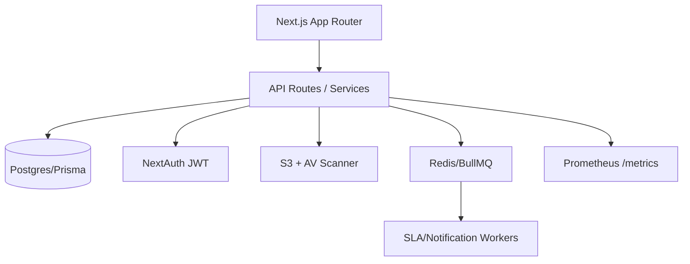
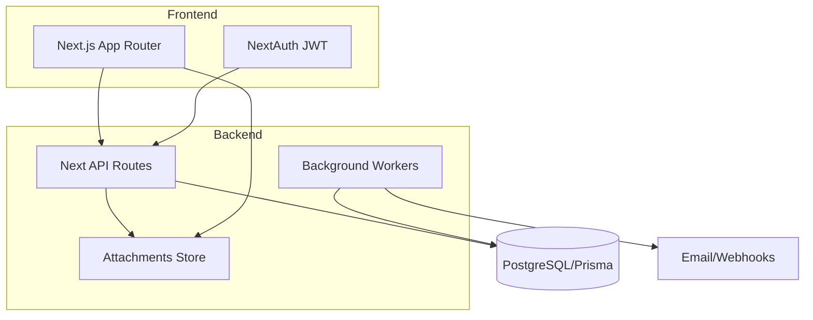

## Executive Summary
SerwisDesk is a Next.js + Prisma helpdesk MVP with credential-based auth, ticket intake, role-scoped visibility, SLA stamping, and comment workflows. This blueprint consolidates the scattered specifications into a single target design that adds governance (queues, admin controls), collaboration (attachments, internal notes), observability (reporting, audit), and hardened security/ops practices while keeping the stack lean and testable.

## Current State (Condensed)
1. App built on Next.js with Prisma, NextAuth, and Tailwind for a web helpdesk MVP.【F:README.md†L1-L3】
2. Runtime dependencies call for Node 22+, pnpm, and Postgres connectivity.【F:README.md†L16-L20】
3. Demo login defaults to `admin@serwisdesk.local` / `Admin123!` at http://localhost:3000.【F:README.md†L41-L42】
4. Project scripts cover dev/build, Prisma migrate/seed, and placeholder unit/e2e test commands.【F:README.md†L44-L49】
5. Domain model includes Organization, User (roles REQUESTER/AGENT/ADMIN), Team, Ticket, Comment, Attachment, Tag, TicketTag, AuditEvent, and SlaPolicy.【F:README.md†L51-L55】
6. MVP capabilities: credentials login, requester-scoped ticket list, ticket creation with SLA due stamps, ticket details, public/internal comments, seeded demo org/users/team/ticket.【F:README.md†L56-L61】【F:prisma/seed.js†L7-L146】
7. Authenticated app layout enforces login and shows a top bar with user role metadata.【F:src/app/app/layout.tsx†L6-L16】
8. Providers wrap pages with NextAuth session context, React Query client, and global toaster notifications.【F:src/app/providers.tsx†L3-L18】
9. Dashboard filters tickets by status, priority, and free-text search across title/description; results are role-scoped.【F:src/app/app/page.tsx†L37-L65】【F:src/app/app/page.tsx†L47-L52】
10. Ticket cards display number, priority pill, title, status, requester, assignee, team, and creation timestamp.【F:src/app/app/page.tsx†L186-L209】
11. Dashboard embeds a “quick ticket” form for inline submission.【F:src/app/app/page.tsx†L215-L218】
12. Ticket form enforces client-side min/max lengths for title/description/category and tracks field-level errors.【F:src/app/app/ticket-form.tsx†L20-L57】
13. Description supports Markdown editing with an edit/preview toggle and GFM rendering.【F:src/app/app/ticket-form.tsx†L112-L155】
14. Ticket submission disables inputs, posts to `/api/tickets`, surfaces API errors, resets state, and refreshes the router on success.【F:src/app/app/ticket-form.tsx†L59-L86】
15. Login flow uses credential sign-in, in-form validation, error messaging, and callback-aware redirects.【F:src/app/login/page.tsx†L16-L76】
16. Ticket detail fetches requester/assignee/team plus ordered comments; requesters are blocked from viewing others’ tickets.【F:src/app/app/tickets/[id]/page.tsx†L51-L97】
17. Ticket header shows number, priority/status badges, requester, assignee, team, creation time, and description rendered from Markdown.【F:src/app/app/tickets/[id]/page.tsx†L108-L154】【F:src/app/app/tickets/[id]/page.tsx†L131-L134】
18. Comments timeline differentiates internal vs public notes, shows author role badges, and timestamps, with a form gating internal checkbox to non-requesters.【F:src/app/app/tickets/[id]/page.tsx†L167-L227】【F:src/app/app/tickets/[id]/comment-form.tsx†L19-L67】
19. Ticket actions allow agents/admins full status selection; requesters can only close or reopen their own tickets.【F:src/app/app/tickets/[id]/ticket-actions.tsx†L51-L148】
20. Agents/admins can change assignee user/team via dedicated controls that respect pending state and avoid redundant saves.【F:src/app/app/tickets/[id]/ticket-actions.tsx†L152-L205】
21. Ticket creation API validates payloads with Zod, stamps SLA due dates (first response/resolve) based on priority, and logs an audit event.【F:src/app/api/tickets/route.ts†L52-L88】
22. Ticket update API blocks cross-org access, restricts requesters to closing/reopening only, validates agent assignee/priority changes, and writes audit trails.【F:src/app/api/tickets/[id]/route.ts†L59-L170】【F:src/app/api/tickets/[id]/route.ts†L176-L196】
23. Comments API forbids internal notes from requesters, requires authentication, and records first-response timestamp for public agent replies.【F:src/app/api/tickets/[id]/comments/route.ts†L32-L58】
24. Prisma schema encodes ticket numbering, status/priority enums, due date fields, and relations for tags, comments, attachments, and SLA policies.【F:prisma/schema.prisma†L16-L192】
25. Seed script provisions demo org, admin/agent/requester users with hashed passwords, IT Support team membership, SLA policies per priority, sample tags, ticket, comment, and audit event.【F:prisma/seed.js†L7-L146】

## Target Specification
### Workflow & Queues
- Unified ticket lifecycle: intake → triage (queue per team) → assignment → work → resolution → verification → closure → potential reopen. Queue views support filters for status, priority, team, assignee, SLA breach, and tags. Add Kanban and list modes with saved views.
- Transition guards: status transitions configurable per role; reopening requires requester justification; resolution requires root-cause & workaround fields.
- Automation hooks: auto-assign by team load, SLA timers triggering notifications/escalations, and category-based routing rules.

### Permissions & Scoping
- Org isolation by `organizationId` for all resources. Roles: REQUESTER (own tickets, public comments, reopen/close own), AGENT (org-wide tickets, internal notes, assignment/status/priority changes), ADMIN (agent rights + user/team/tag/SLA/admin settings). Support optional Team Lead role for queue management and approvals.
- Field-level controls: internal comments hidden from requesters; attachments visibility toggled (public/internal); audit logs immutable and admin-only.

### Collaboration
- Comments (public/internal), @mentions for users/teams, rich Markdown preview, emoji reactions. Threading for comments optional in later phase. Activity feed merges audit events, status changes, and SLA alerts.

### Attachments
- File uploads with antivirus scanning, size/type whitelist, per-ticket storage paths, metadata (uploader, mime, size, checksum). Public vs internal flag mirrors comment visibility. Support drag/drop and progress indicators.

### SLA & Notifications
- SLA policy per priority + optional category/team overrides. Fields: first-response/resolve targets, pause rules (waiting on requester), timezone awareness. Notifications for breaches/imminent breaches to assignee/team/admin and requester (for public updates). SLA clock pause/resume on status changes.

### Admin & Configuration
- Admin console: manage users, teams, memberships, tags, categories, templates, SLA policies, automation rules, and canned responses. Audit every admin change. Import/export seeds.

### Reporting & Observability
- Dashboards for ticket volume, SLA attainment, MTTR/MTTA, backlog aging, reopen rate, CSAT (later). Export CSV and schedule reports. System health metrics (queue length, worker lag) exposed via /metrics.

### UX Contract (Routes & Key States)
- Public: `/login` (success/error/loading states), `/` redirects to `/app` when authenticated.
- Authenticated shell `/app`: top bar with role/logout, global toasts.
- `/app` dashboard: filters, cards/kanban, empty-state CTA, quick-create form, pagination.
- `/app/tickets/new`: full form with validation, markdown preview, attachment uploads, SLA preview.
- `/app/tickets/:id`: header (status/priority badges, requester, assignee/team), action panel (status/assignment/priority), SLA timers, activity feed (comments/audit), attachment list, internal/public toggles, reopen/close flows.
- `/app/admin/*`: users, teams, tags, SLA policies, automation rules, reporting pages with search/sort/pagination.

### API Contract (High-Level)
- Auth: NextAuth credentials; future SSO providers pluggable. JWT session strategy continues.
- Tickets: `GET /api/tickets` (filters: status, priority, q, team, assignee, sla state), `POST /api/tickets` (title, descriptionMd, priority, category, tags, attachments, requester metadata). `PATCH /api/tickets/:id` (status, priority, assigneeUserId, assigneeTeamId, category, tags, SLA pause/resume). 
- Comments: `POST /api/tickets/:id/comments` (bodyMd, isInternal, attachments, mentions) with rate-limiting and permission checks.
- Attachments: `POST /api/tickets/:id/attachments` (multipart) returning signed URLs; `DELETE` to revoke.
- Admin: CRUD for users, teams, tags, SLA policies, automation rules.
- Reporting: `GET /api/reports/:type` with async job handles and export links.

### Architecture
- **Current**: Next.js app router, server components backed by Prisma/Postgres, NextAuth credentials, React Query + client components for mutations, Sonner toasts. API routes under `/api/tickets` handle CRUD and SLA stamping; Prisma schema models tickets/comments/attachments/tags/SLA with org scoping.【F:src/app/api/tickets/route.ts†L52-L88】【F:prisma/schema.prisma†L94-L192】
- **Target**: Add background worker (BullMQ/Redis) for SLA timers/notifications, file storage (S3-compatible) fronted by presigned URLs, antivirus sidecar, metrics endpoint, and admin UI. Introduce domain services (TicketService, CommentService, AttachmentService) separating policy from transport. Feature flags via config table.
- **Mermaid (target high-level)**

### Data Model Strategy & Migrations
- Extend Ticket with: `categoryId`, `slaPausedAt`, `slaResumeAt`, `breachNotifiedAt`, `csatScore`, `resolutionSummary`, `rootCause`, `workaround`, `reopenReason`. Add `Attachment.visibility` enum (PUBLIC/INTERNAL) and `checksum`. Add `AutomationRule`, `ReportJob`, `Notification` tables. Introduce `TeamRole`/`UserPreference` tables for notifications.
- Migration plan: backward-compatible columns with defaults/nullables, data backfill scripts for existing tickets, add indexes (status, priority, team, due dates), and unique constraints for org+name across new taxonomies. Seed updates for demo data.

### Security & Ops Baseline
- Enforce org scoping on all queries (guards already present on tickets; extend to attachments/admin endpoints).【F:src/app/api/tickets/[id]/route.ts†L39-L170】
- Input validation via Zod for all APIs; sanitize Markdown output; limit payload sizes and rate-limit comment/ticket/attachment endpoints.
- AuthN/Z: JWT sessions, credential hashing (bcrypt), role checks server-side, CSRF protection via NextAuth defaults. Add two-factor and audit login attempts in future.
- Data protection: encrypt secrets, S3 buckets private by default, signed URLs, AV scanning, checksum verification, retention policies.
- Observability: request logging, audit events for sensitive changes, metrics for SLA timers/queues, structured logs for compliance.

### Testing Strategy
- Unit: domain services (ticket transitions, SLA calculations, assignment rules, notification templating).
- Integration: API routes with role matrices (requester/agent/admin), org isolation, SLA due stamping, attachment upload flow (with AV mock).
- E2E: Playwright flows for login, ticket CRUD, comments (public/internal), assignment, SLA breach banner, admin CRUD. 
- Non-functional: load test ticket list filters, attachment upload size limits, and queue throughput; security tests for auth bypass and injection; accessibility audits with axe.
- Proof requirements: each user-facing capability ships with automated tests + screenshots for UI changes; migrations validated via `prisma migrate dev --create-only` in CI, with seed sanity checks.

### Risks & Mitigations (Top 20)
1. Org boundary leakage → enforce org filters in every query/service; covered by tasks 012, 041, 078.
2. SLA timers inaccurate → centralize in worker with clock skew buffers; tasks 057, 063, 090.
3. File upload abuse (virus/size) → AV scan, size/type caps; tasks 048, 049, 050.
4. Permission drift between UI/API → shared policy module + contract tests; tasks 015, 040, 079.
5. Migration breaking existing data → phased migrations with backfill scripts and rollbacks; tasks 021, 022, 023.
6. Notification spam → rate limits and dedup; tasks 066, 067.
7. Comment spam/abuse → rate limit + captcha fallback; tasks 033, 094.
8. Reopen abuse by requesters → justification requirement + throttling; tasks 076, 095.
9. Queue/worker downtime → retries, dead-letter queues, health checks; tasks 061, 062, 118.
10. Attachment PII exposure → visibility flag + signed URLs; tasks 048, 050, 082.
11. Audit gaps → ensure audit on all admin changes; tasks 071, 072.
12. Reporting performance → async report jobs + indexes; tasks 098, 099.
13. Cross-site scripting via Markdown → sanitize Markdown render; tasks 014, 034.
14. Credential brute force → lockout/rate limit login; tasks 030, 031.
15. Incomplete test coverage → add test matrix gates; tasks 017, 088, 110.
16. Environment drift → infra-as-code and env validation; tasks 005, 006, 104.
17. Lost metrics → `/metrics` endpoint and alerts; tasks 101, 102.
18. CSAT data integrity → one-response-per-ticket and signature; tasks 097, 109.
19. Tag/category sprawl → admin governance + cleanup jobs; tasks 070, 111.
20. Privacy of internal notes → strict visibility checks and logging; tasks 018, 045, 082.

### Unknowns & Verification Steps
- Email/SMS provider availability for notifications → verify credentials/providers (Twilio/SendGrid) during Phase P1 setup; fallback to in-app notifications.
- Target file storage (S3 vs local/minio) → confirm infra constraints; prototype with MinIO in Phase P0.
- Authentication extensibility (SSO/LDAP) → determine enterprise requirements; spike in Phase P1.
- Reporting volume expectations → collect baseline metrics during P0/P1 to size indexes and retention.
- Support hours/timezone for SLA calculations → gather business rules; add config in Phase P0 admin seed.

# Master Blueprint

## Executive Summary
SerwisDesk is a Next.js 16 helpdesk MVP with Prisma/PostgreSQL and NextAuth credential login. Current capabilities cover authentication, ticket CRUD (create/read/update status/assignment/priority), comments with internal visibility, tag/SLA policies, and seeded demo data. Missing source specialist documents mean this blueprint consolidates evidence from code and README only; gaps are recorded in the decision log and master audit. Target state extends the MVP with attachments, admin consoles, reporting, and hardened security/ops aligned to the dependency-ordered execution plan.

## Current State (evidence-backed, condensed)
1. Tech stack uses Next.js with Prisma, NextAuth, and Tailwind for a web helpdesk.【F:README.md†L1-L4】
2. Requires Node 22+, pnpm, and PostgreSQL with env vars `DATABASE_URL` and `NEXTAUTH_SECRET`.【F:README.md†L16-L35】
3. Default auth relies on NextAuth credentials with PrismaAdapter, JWT sessions, and login page at `/login`.【F:src/lib/auth.ts†L21-L80】
4. Roles are REQUESTER, AGENT, ADMIN in the Prisma schema and used in auth tokens.【F:prisma/schema.prisma†L10-L24】【F:src/lib/auth.ts†L60-L77】
5. Ticket statuses cover NEW→IN PROGRESS→AWAITING USER→ON HOLD→RESOLVED→CLOSED→REOPENED flow.【F:prisma/schema.prisma†L16-L24】
6. Ticket priorities are NISKI/SREDNI/WYSOKI/KRYTYCZNY with defaults to SREDNI.【F:prisma/schema.prisma†L26-L31】【F:prisma/schema.prisma†L94-L120】
7. Ticket model tracks requester, optional assignee user/team, category, tags, comments, attachments, audit events, SLA due dates, resolved/closed timestamps.【F:prisma/schema.prisma†L94-L120】
8. Comments support `isInternal` flag (default false) with author and timestamp metadata.【F:prisma/schema.prisma†L123-L132】
9. Attachments table stores filename, path, MIME type, size, and uploader relations.【F:prisma/schema.prisma†L134-L145】
10. Tags and TicketTag provide org-scoped labeling with composite uniqueness.【F:prisma/schema.prisma†L147-L168】
11. AuditEvent records actor, action, JSON payload per ticket change.【F:prisma/schema.prisma†L170-L179】
12. SLA policies define first-response/resolve hours per priority, unique per org/priority.【F:prisma/schema.prisma†L181-L192】
13. Seed script provisions Demo org, admin/agent/requester users with hashed passwords, IT Support team membership, tags, SLA policies, and a sample ticket/comment/audit event.【F:prisma/seed.js†L7-L145】
14. README lists seeded demo credentials `admin@serwisdesk.local / Admin123!` and local dev URL `http://localhost:3000`.【F:README.md†L37-L43】
15. Login page performs credential sign-in with inline error and disables button while loading.【F:src/app/login/page.tsx†L7-L76】
16. Home route redirects unauthenticated users to `/login` and authenticated users to `/app`.【F:src/app/page.tsx†L1-L11】
17. App layout enforces authenticated sessions and shows top bar with user name/role plus sign-out button.【F:src/app/app/layout.tsx†L1-L17】【F:src/components/topbar.tsx†L1-L19】
18. Dashboard fetches tickets scoped to requester (own) or organization (agent/admin) with filters for status, priority, and search query and renders cards plus quick-create form.【F:src/app/app/page.tsx†L25-L219】
19. Ticket creation validates title/description/category lengths client-side and posts to `/api/tickets`, resetting form and showing toast feedback.【F:src/app/app/ticket-form.tsx†L10-L237】
20. API `POST /api/tickets` validates with zod, applies SLA due dates from SlaPolicy, sets status NOWE, and logs audit event.【F:src/app/api/tickets/route.ts†L9-L88】
21. Ticket detail enforces requester-only visibility for own tickets; otherwise redirects 404.【F:src/app/app/tickets/[id]/page.tsx†L51-L99】
22. Assignment options for agents/admins load organization agents/teams; requesters see empty lists.【F:src/app/app/tickets/[id]/page.tsx†L72-L165】
23. TicketActions restrict requester status changes to close or reopen and block priority/assignee changes for requesters; agents/admins can update all fields with audit trail through API.【F:src/app/api/tickets/[id]/route.ts†L8-L211】
24. Comment form permits internal comments only when allowed (non-requesters) and posts to `/api/tickets/{id}/comments` with toast feedback.【F:src/app/app/tickets/[id]/comment-form.tsx†L7-L67】
25. Comment API blocks internal comments from requesters, marks firstResponseAt when an agent posts the first public comment.【F:src/app/api/tickets/[id]/comments/route.ts†L7-L59】
26. README notes future work: admin panel, attachments, reporting/Kanban/dashboard, E2E/unit tests, Dockerfile/docker-compose.【F:README.md†L63-L67】

## Target Specification
- **Workflow:** Maintain current ticket flow with SLA timers; add triage queue, bulk actions, and escalation to teams; enable reopen with audit; enforce business rules (e.g., cannot close without public reply, block reopen if locked by admin override).
- **Permissions/Scoping:** Org-scoped data; requesters see/create their tickets; agents/admins manage org tickets; admins manage users/teams/SLA; fine-grained scopes for attachments, internal notes, and configuration.
- **Queues:** Saved filters for “My tickets”, “Unassigned”, “Overdue SLA”, “Awaiting user”, “Recently updated”; Kanban by status for agents; pageable/searchable list for requesters.
- **Collaboration:** Public/internal comments with mentions; activity log per ticket; email/web push hooks; typing indicator optional; enforce visibility rules mirroring current API constraints.
- **Attachments:** Upload with MIME/size validation, virus scan stub, storage abstraction (local/S3), preview for images/text; associate to comments and ticket body; download authorization by org/role.
- **SLA:** Configurable per priority/category with calendars/holidays; breach tracking, reminders, escalation policies; SLA history versioning with migration path.
- **Admin:** Org admin console for users, teams, memberships, roles, tags, categories, SLA policies, canned responses, and auth settings (password policy, session lifetime). Audit trails for admin actions.
- **Reporting:** KPI dashboard (volumes, SLA compliance, reopen rate), export (CSV), search analytics; background jobs for aggregates.

## Architecture
- **Current:** Next.js app router with server components for data fetch; Prisma/PostgreSQL; NextAuth credential JWT; client components for forms; API routes for tickets/comments; seed data; Tailwind UI.
- **Target:** Add storage service (local/S3), job runner (e.g., queue/cron) for SLA checks and reporting, mailer service, and admin UI module. Maintain Prisma with migrations; add background workers reading same DB.

## Data Model Strategy & Migrations
- Preserve core schema; add attachment storage metadata (checksum, storageProvider, virusScanStatus), comment-to-attachment relation, SLA versioning table, user preferences, notification table, report snapshots.
- Enforce org-level uniqueness for categories/tags; add soft-delete flags for entities to support auditability.
- Migration plan: additive migrations per phase, backfill scripts for SLA due dates, default teams, and indexes on ticket search fields.

## API Contract (high-level)
- **Auth:** POST `/api/auth/[...nextauth]` (NextAuth) with credential provider.
- **Tickets:** GET `/api/tickets` (filtered by role); POST `/api/tickets` with validated payload; GET/PATCH `/api/tickets/{id}` for status/priority/assignments with role checks; future: DELETE (admin), bulk PATCH, SLA escalate endpoint, attachment upload endpoints.
- **Comments:** POST `/api/tickets/{id}/comments` with `isInternal` rules; future: GET paginated comments, edit/delete by author/admin.
- **Admin (target):** CRUD for users/teams/tags/SLA, report exports, system settings endpoints.

## UX Contract (routes + key states)
- `/login`: credential form with loading/error state.
- `/app`: dashboard with filters, cards, quick-create; empty state card when no tickets.
- `/app/tickets/new`: full ticket form with validation, markdown preview.
- `/app/tickets/{id}`: details with metadata pills, markdown description, assignment/status controls (role-based), comments timeline (internal badges), add comment form.
- Target additions: admin console routes (`/app/admin/*`), Kanban view (`/app/boards`), reports (`/app/reports`), attachments viewer modal, notification center.

## Security & Ops Baseline
- Auth via credentials + bcrypt hash; JWT session with role/org claims.【F:src/lib/auth.ts†L21-L80】
- Role checks on ticket/comment APIs; requester scoped to own tickets; org scoping on all ticket updates.【F:src/app/api/tickets/[id]/route.ts†L26-L211】【F:src/app/api/tickets/[id]/comments/route.ts†L7-L59】
- Demo passwords seeded; need rotation and secret management (ENV).【F:prisma/seed.js†L14-L145】
- Logging via AuditEvent for ticket create/update; extend to admin changes and attachments.【F:prisma/schema.prisma†L170-L179】【F:src/app/api/tickets/route.ts†L64-L88】
- Ops: add rate limiting, input size limits, file scanning, backup/restore runbooks, monitoring for SLA breach jobs.

## Testing Strategy
- Unit: zod validators, role guards, SLA calculators, form validators.
- Integration: API routes for tickets/comments with role matrix (requester/agent/admin), assignment validation, SLA due calculations.
- E2E: login, create ticket, comment internal/public, status transitions, assignment changes, reopen/close, filters/search, quick-create.
- Non-functional: file upload size/virus-scan hooks, load tests on ticket listing, accessibility (aria labels already present on forms).【F:src/app/app/ticket-form.tsx†L88-L185】
- CI: lint/test (Vitest/Playwright placeholders in scripts) plus Prisma migrate check and seed smoke run.【F:package.json†L6-L53】

## Top Risks & Mitigations (mapped to Execution Plan)
1. Missing specialist specs may misalign features — Mitigation: tasks 001, 004, 115 update docs after discovery.
2. XSS from markdown/user input — Mitigation: tasks 009, 014 sanitize rendering; 024 AV scan for attachments.
3. Unauthorized data access across orgs — Mitigation: tasks 011-012, 081-082 strengthen org guards/tests.
4. Brute force/login abuse — Mitigation: tasks 013, 026 rate limiting; 108 login logging/2FA stub.
5. Attachment malware or leakage — Mitigation: tasks 021-025, 052-054 add metadata, scanning, presigned URLs.
6. SLA breaches unnoticed — Mitigation: tasks 029, 049, 102 add fields, worker, alerts.
7. Missing backups/DR — Mitigation: tasks 005, 103, 118, 120 create compose, drills, failover plans.
8. Audit gaps for admin changes — Mitigation: tasks 015, 056, 064 add permission matrix and audit UI/exports.
9. Performance issues on ticket lists — Mitigation: tasks 034, 061, 105, 114 add pagination, indexes, perf tests.
10. Spam/abuse via comments — Mitigation: tasks 026, 033, 094 add rate limits, cooldowns, captcha fallback.
11. Privacy/compliance gaps — Mitigation: tasks 070, 107, 115 map retention and compliance checklist.
12. Notification noise or failure — Mitigation: tasks 031-033, 046-050, 102 set preferences, workers, alerts.
13. Attachment storage cost/scale — Mitigation: tasks 052-054, 118 cost/optimization and provider toggle.
14. Reporting accuracy — Mitigation: tasks 083-085, 097, 098 build fact tables, dashboards, performance tuning.
15. Search relevance/bugs — Mitigation: tasks 028, 061, 104 add category taxonomy, full-text facets.
16. Unpatched dependencies — Mitigation: tasks 015, 006, 113 run lint/tests; plan periodic audits (Phase 0/ongoing).
17. Unauthorized reopen/close — Mitigation: tasks 055, 095 enforce approvals and audit history.
18. Observability blind spots — Mitigation: tasks 019, 101-102, 100 add logging, metrics, alerts.
19. Feature rollout risk — Mitigation: tasks 112 enable feature flags and checkpoints every 10–15 tasks.
20. Data loss from purge/retention jobs — Mitigation: tasks 094, 107, 111 add dry runs and cleanup cron safeguards.
